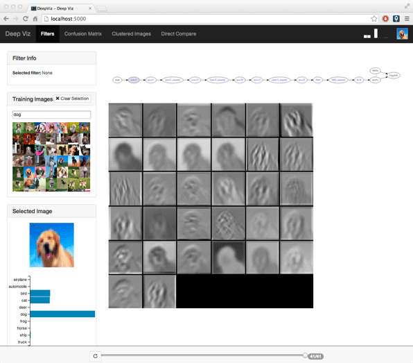

# DeepViz

DeepViz is an interactive tool for visualizing deep [convolutional neural networks](https://en.wikipedia.org/wiki/Convolutional_neural_network) that perform image classification.




## Installation

DeepViz's Python library dependencies are listed in [./webui/requirements.txt](./webui/requirements.txt); you can install them using pip by running `pip install -r requirements.txt`.  Some of these libraries depend on scipy and numpy, which can take a while to build from their sources.  If you want to quickly get up and running on a machine that doesn't have these dependencies installed, it might be easiest to install a Python distribution like [Anaconda](https://store.continuum.io/cshop/anaconda/) that includes these libraries, then install the rest of the  libraries using `pip install -r requirements.txt`.

## Usage

### Sample Datasets

DeepViz requires several input datasets: the image corpus used to train the model, a series of checkpoints of the model during its training, and a set of precomputed statistics about the model's predictions.  To get started quickly, you can use these precomputed datasets:

- [CIFAR-10 Image Corpus](http://www.cs.toronto.edu/~kriz/cifar-10-py-colmajor.tar.gz)
- [Model Checkpoints](https://www.dropbox.com/s/t1ykv2r6i6n8ggg/80secModel41chkpts.tar.gz)
- [Model Stats DB](https://www.dropbox.com/s/n6e6dfsk09ojchz/stats_db_2013-12-11.tar.gz)


### Running the Web UI

To start the web UI, run

```
./webui/runserver.py --model MODEL --cifar CIFAR --model-stats MODEL_STATS
```

where `MODEL` is the path to a path to a directory of snapshots of models trained by [cuda-convnet](https://code.google.com/p/cuda-convnet/), `CIFAR` is a path to a copy of the [CIFAR-10](http://www.cs.toronto.edu/~kriz/cifar.html) image corpus, and `MODEL_STATS` is a database of statistics computed offline on the trained models (see section below).

If everything worked correctly, you should be able to browse to [http://localhost:5000](http://localhost:5000) to view the UI.

### Training a Model

### Computing Model Statistics

The model statistics database contains pre-computed statistics about the model's predictions at each checkpoint.  These databases can be generated from a trained model using the `build_model_stats_db` script:

```
./webui/deepviz_webui/build_model_stats_db.py --model MODEL --cifar CIFAR --num-classes 10 --output-dir MODEL_STATS
```